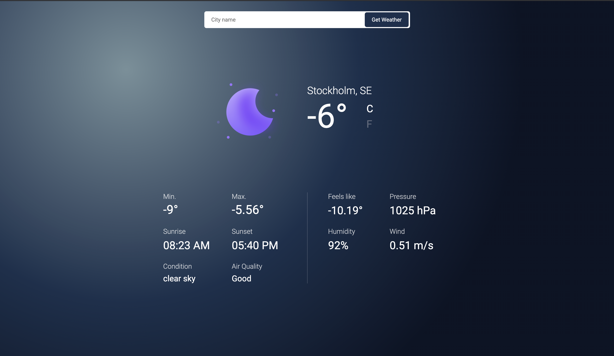

# Weather App

> In this project I have used the api https://openweathermap.org/ for weather data. The current weather information is displayed for a any city that we enter. Along with weather information, I'm fetching the air pollution data aas well and displaying the quality of air from 1 to 5, Where 1 = Good, 2 = Fair, 3 = Moderate, 4 = Poor, 5 = Very Poor.

- I have used a default Stockholm as a default city for first load.
- I have used Axios to work with asyncronous data.
- I have used momentjs for date, time and timezone conversion
- Enter the city name to get the weather information.
- Weather icons are also changing as per the condition of the weather and as per the day or night.
- Temerature can be changed on the click of 'C' and 'F' to display in Celcius or Farenheit.

> Main Page
> 

## Built With

- Javascript
- openweathermap API
- Axios
- Jquery
- Webpack
- ESLint
- Stylelint

## Live Demo

[Weather-App](https://weather-app-sable-two.vercel.app/)

### Prerequisites

Node

**Setup**

- Clone this repository with: "git clone git@github.com:Amita-Roy/Weather-App.git" using your terminal or command line.

- Change to the project directory by entering cd "weather-app" in the terminal

- Next run npm install to install the necessary dependencies

- Finally run the 'npm run build' and 'npm start' to start the application

- 'npm run dev' is for building the project in development mode

- 'npm run build' is for building the project in production mode

- 'npm start' is for starting the server in development mode

### Usage

Start server with:

```
    npm start
```

## Author

👤 **Amita Roy**

- Github: [@Amita](https://github.com/Amita-Roy)
- Twitter: [@Amita](https://twitter.com/AmitaRoy14)
- Linkedin: [@Amita](https://www.linkedin.com/in/amita-roy-3b823b68/)

## 🤝 Contributing

Contributions, issues and feature requests are welcome!

Feel free to check the [issues page](issues/).

## Show your support

Give a ⭐️ if you like this project!

## 📝 License
